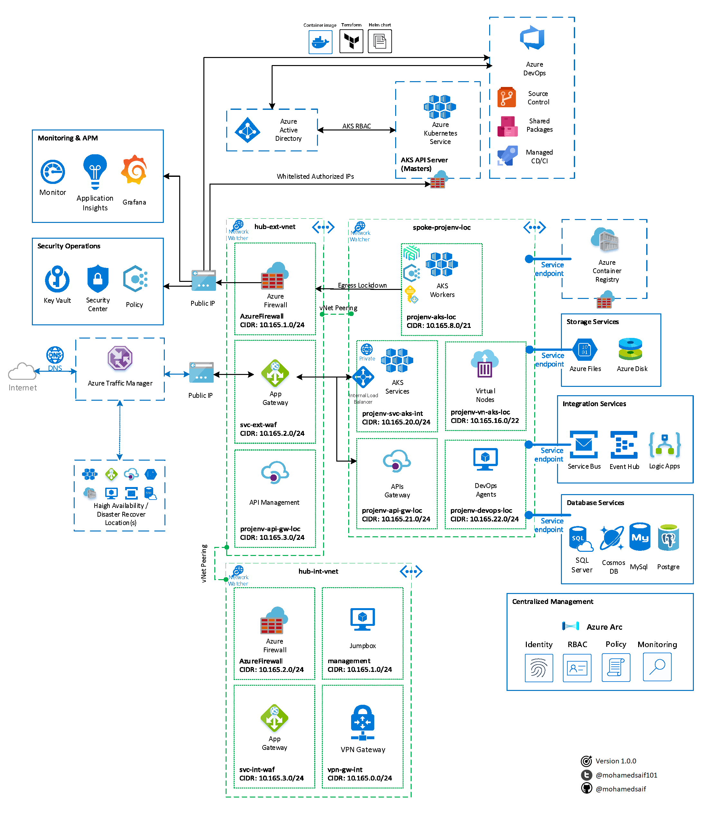

# AKS-Adv-Provision

My views on deploying AKS with advanced provisions for development and production environments. 



## Provisioning Scripts and Configuration

Under [provisioning-v2](/provisioning-v2) folder you will find all deployment scripts and configuration. 

I've put all the commands in a numbered sequential shell scripts in the folder.

You can fork the repo and update the scripts with your customizations

> **NOTE:** This is a work on progress and will keep improving when I can to include recently released AKS features and versions

Currently the scripts applied to:
- Azure CLI version 2.0.81
- AKS Kubernetes version 1.15.7 (1.17.0 latest AKS preview)
- kubectl version 1.16.3
- helm version 2.16.0 (to be updated to 3 🤞)

## Provisioning v2 Structure

I separated the provisioning of v1 style into separate files for better locating the information related to AKS.

The current files structure for v2 to is:

```bash

/provisioning-v2
.
├── 00-template.sh
├── 01-main.sh
├── 02-variables.sh
├── 03-login.sh
├── 04-preview-providers.sh
├── 05-tags.sh
├── 06-resource-groups.sh
├── 07-monitoring.sh
├── 08-key-vault.sh
├── 09-virtual-network.sh
├── 10-app-gateway.sh
├── 11-jump-box.sh
├── 12-apim.sh
├── 13-container-registry.sh
├── 14-aks-pip.sh
├── 15-aad-aks-sp.sh
├── 16-aad-aks-auth.sh
├── 17-aks.sh
├── 18-aks-post-provision.sh
├── 19-aks-add-role-binding.sh
├── 20-aks-node-pools.sh
├── 21-pod-identity.sh
├── 22-agic.sh
├── 23-azure-firewall.sh
├── 24-aks-policy.sh
├── 25-aks-maintenance.sh
├── 26-traffic-manager.sh
├── deployments
│   ├── aad-pod-identity-binding.yaml
│   ├── aad-pod-identity.yaml
│   ├── aad-user-cluster-admin-binding.yaml
│   ├── agic-helm-config.yaml
│   ├── agic-sp-helm-config.yaml
│   ├── apim-deployment.json
│   ├── dashboard-proxy-binding.yaml
│   ├── helm-admin-rbac.yaml
│   ├── helm-dev-rbac.yaml
│   ├── helm-sre-rbac.yaml
│   ├── logs-workspace-deployment.json
│   ├── monitoring-log-reader-rbac.yaml
│   ├── nginx-deployment.yaml
│   ├── nginx-ingress-deployment.yaml
│   └── nginx-ingress-tls-deployment.yaml

```

## About the project

I tried to make sure I cover all aspects and best practices while building this project, but all included architecture, code, documentation and any other artifact represent my personal opinion only. Think of it as a suggestion of how a one way things can work.

Keep in mind that this is a work-in-progress, I will continue to contribute to it when I can.

All constructive feedback is welcomed 🙏

## Support

You can always create issue, suggest an update through PR or direct message me on [Twitter](https://twitter.com/mohamedsaif101).

## Authors

|                  |
|:----------------------------------------------:|
|                 **Mohamed Saif**               |
|     [GitHub](https://github.com/mohamedsaif)   |
|  [Twitter](https://twitter.com/mohamedsaif101) |
|         [Blog](http://blog.mohamedsaif.com)    |